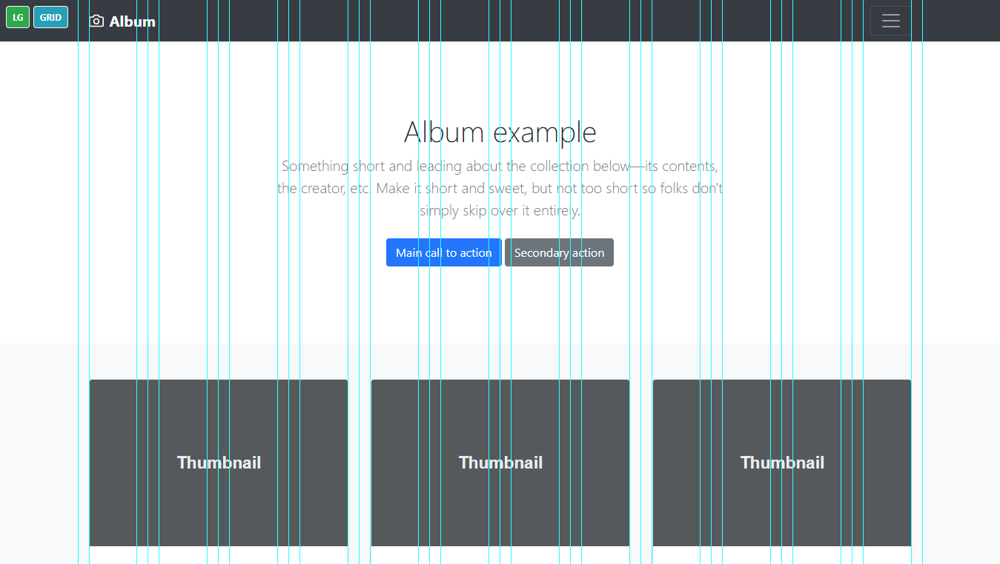

# bs4-grid-guides
Illustrator-like grid guides for Bootstrap 4

## How to use
Paste content of bs4grid.html after your &lt;body&gt; tag.

Toggle <strong>GRID</strong> button in bottom-left corner of screen to show guides.

## Requirements
Requires bootstrap.css and bootstrap.js files version 4.1 or newer.

## Example

